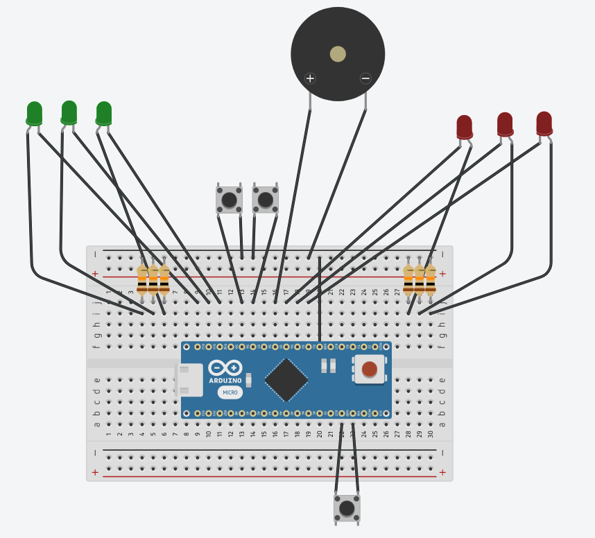
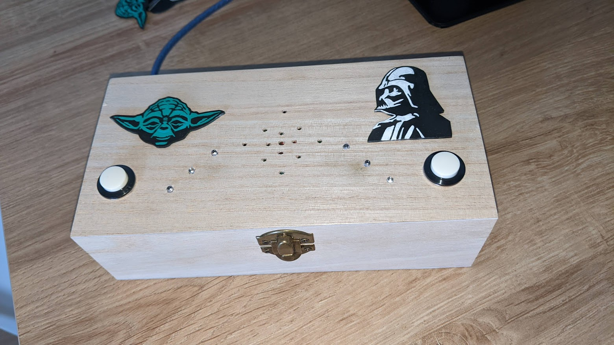
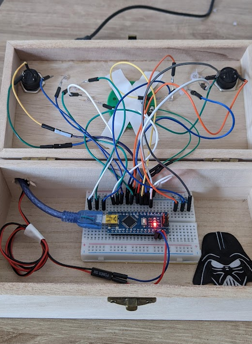

# Starwars Music Box

Projet d'une boite à musique sur le thème de Star wars. 

Deux boutons incarnent les deux côtés de la Force. 

Le bouton du côté Obscure permet de lancer le thème de la marche impériale. Des LEDs rouges s'allument.

Le bouton du côté lumineux permet de lancer le thème principal de star wars. Des LEDs vertes s'allument. 

# Schéma 
Liste des composants : 
* Arduino Nano
* 3 LEDs vertes
* 3 LEDs rouges
* 6 Résistances 10k
* 3 boutons poussoirs
* 1 buzzer
* 1 alimentation USB
* 1 boite en bois

# Montage

L'ensemble du montage est mis dans la boite en bois.

Des trous sont percés pour faire sortir l'extrémité des 6 LEDs. Elles sont ensuite fixées avec de la colle chaude. 

Les boutons sont également posés sur le dessus de la boite. 

Enfin de petits trous sont percés au niveau du buzzer pour ne pas étouffer le son. 

# Code
[Le code Arduino](StarWarsMusicBox/StarWarsMusicBox.ino)